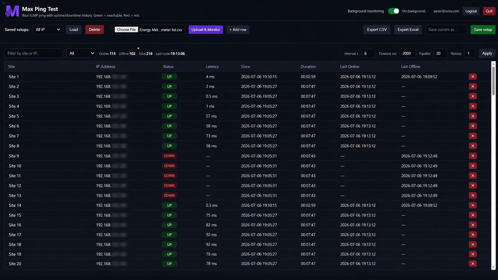

<div align="center">


# Max Ping Test

**Bulk IP Ping Tester & Uptime Monitor for Windows**

[](https://github.com/maheshmaximusmax/max-ping-test/releases)
[](https://github.com/maheshmaximusmax/max-ping-test/releases)
[](https://github.com/maheshmaximusmax/max-ping-test/releases/latest)
[](https://github.com/maheshmaximusmax/max-ping-test/releases/latest)
[](https://github.com/maheshmaximusmax/max-ping-test/releases/latest)

**Upload a CSV or Excel sheet → auto-detect all IPs → real-time green/red ping status.**  
One `.exe` file. No Python. No install. Works on any Windows PC.

[⬇️ **Download .exe**](https://github.com/maheshmaximusmax/max-ping-test/releases/latest) &nbsp;·&nbsp; [📸 Screenshots](#screenshots) &nbsp;·&nbsp; [⚡ Quick Start](#quick-start) &nbsp;·&nbsp; [✨ Features](#features) &nbsp;·&nbsp; [❓ FAQ](#faq)

</div>

---

## Screenshots

### Login Screen


### Live Dashboard — 114 Online · 102 Offline · 216 Devices · Real-time


---

## What Is Max Ping Test?

Max Ping Test is a **free single-file Windows app** for bulk IP ping monitoring.

Upload your IP address list (CSV or Excel in any layout), and it pings **all of them in parallel** — showing a live table with:
- 🟢 **Green = Online** (with real latency in ms)
- 🔴 **Red = Offline** (with how long it has been down)
- 📅 Full uptime/downtime history saved to disk

Built for **network engineers, automation engineers, and SCADA operators** who monitor dozens to hundreds of devices — energy meters, PLCs, HMIs, IoT gateways, routers — across multiple industrial sites.

> No Python. No .NET. No install. One `.exe` that runs on any Windows PC.

---

## Quick Start

### 1. Download
Go to [**Releases**](https://github.com/maheshmaximusmax/max-ping-test/releases/latest) and download `Max Ping Test.exe`

### 2. Run
Double-click the exe. Your browser opens automatically to the login page.

### 3. Log in
Use your credentials. First-time users: click **Create an account**.

### 4. Upload & Monitor
Click **Choose File**, select your CSV or Excel IP list, click **Upload & Monitor**.  
The app auto-detects every IP address and starts pinging immediately.

### Optional: Desktop Icon
Download the full release zip, extract, run `install.bat` → adds **Max Ping Test** to your Desktop and Start Menu.

---

## Features

### 📋 Upload Any IP Sheet — No Reformatting Needed
Upload **CSV or Excel** files in any layout — messy headers, multi-table, multi-site.  
The app scans every cell and extracts all IPv4 addresses along with their Site Names automatically.

Works with:
- Energy meter sheets with multiple blocks (WD1/WD2/WD3/WD4)
- PLC and HMI device lists
- IoT gateway tables
- SCADA site inventories
- Google Sheets exports (File → Download → CSV)

### 🟢 Real ICMP Ping — No False Results
A host is marked **UP only if the ping reply contains `TTL=`**.  
This means a router's *"Destination host unreachable"* reply is correctly shown as **DOWN** — a common source of false positives in other tools.

Real latency shown (0.5ms–100ms typical on LAN). Offline hosts show `—`.

### 📊 Uptime / Downtime History (Survives Restarts)
Per IP address, the app tracks and saves:

| Column | What it shows |
|--------|--------------|
| **Since** | Date & time the current status started |
| **Duration** | How long in current state (`3d 04:12:07` for days) |
| **Last Online** | Last time the device responded |
| **Last Offline** | Last time the device stopped responding |

History is written to disk every 10 seconds and **survives app restarts**.

### ✏️ Edit Inline, No Spreadsheet Needed
- Click any **Site** or **IP** cell to edit it directly in the table
- **Ctrl+S** or the **Save setup** button saves the current list as a named profile
- Named profiles **auto-load on next launch** — open the app and your list is already there
- Add rows manually for devices not in the original sheet
- Delete any row with the ✕ button

### 📤 Export to CSV or Excel
Export the full live table at any time:
- **Export CSV** — open in any spreadsheet or import into SCADA/reports
- **Export Excel** — formatted `.xlsx` with bold headers
- Filename is timestamped: `MySetup_status_20260706_1900.xlsx`

Exported columns: Site Name, IP Address, Status, Latency (ms), Status Since, Duration, Last Online, Last Offline, Last Checked.

### 🔍 Filter & Search
- Text search by site name or IP address
- Quick filter: **All / Online only / Offline only**
- Counters always visible: Online: 114 · Offline: 102 · Total: 216

### 🔁 Background Monitoring Toggle
- Keep the app monitoring even when the browser tab is minimized
- Toggle ON/OFF without closing the app
- Setting is remembered across restarts

### ⚙️ Configurable Ping Settings

| Setting | Default | Description |
|---------|---------|-------------|
| Interval | 6s | How often all IPs are re-pinged |
| Timeout | 2000ms | Per-host timeout (increase for VPN/WAN) |
| Parallel | 20 | Simultaneous pings (max 60) |
| Retries | 1 | Re-pings before marking DOWN |

### 🔐 Login & User Management
- Login screen on first launch (email + password)
- Admin account works immediately — no setup needed
- **Admin panel**: view all registered users, disable or delete accounts
- Passwords stored as PBKDF2+salt hash (not plain text)

---

## Who Is This For?

| Role | Use case |
|------|----------|
| **Automation / SCADA Engineer** | Monitor PLCs, HMIs, energy meters across plant subnets via WireGuard VPN |
| **Network Engineer** | Bulk ping all devices in a site, track uptime over days |
| **IT Administrator** | Monitor servers, cameras, printers — upload your asset list CSV |
| **Field Engineer** | Copy exe to a USB stick, run on any site PC with no install |
| **Water / Utilities / Power** | Watch IoT gateways and meters across dozens of remote sites |

---

## How It Works

```
Double-click  Max Ping Test.exe
        ↓
App starts a local server (no internet required)
        ↓
Browser opens  →  Login screen
        ↓
Upload your CSV / Excel IP list
        ↓
App scans every cell → finds all IPs + Site Names automatically
        ↓
Pings all IPs in parallel every N seconds (real ICMP with TTL check)
        ↓
Live table:  🟢 UP (real latency)  |  🔴 DOWN
        ↓
History recorded: since when, how long, last seen online/offline
        ↓
Export to CSV or Excel anytime
```

**No internet connection required. Everything runs locally on your PC.**

---

## Compared to Similar Tools

| Feature | **Max Ping Test** | PingInfoView | vmPing | Angry IP |
|---------|:-----------------:|:------------:|:------:|:--------:|
| Upload CSV / Excel IP list | ✅ Any format | ❌ Manual | ❌ Manual | ❌ Range only |
| Auto-detect Site Names | ✅ | ❌ | ❌ | ❌ |
| Real TTL-based detection | ✅ | ✅ | ✅ | ✅ |
| Uptime/downtime history | ✅ With timestamps | ⚠️ Count only | ❌ | ❌ |
| Duration in days | ✅ `3d 04:12:07` | ❌ | ❌ | ❌ |
| Export to Excel (.xlsx) | ✅ | ❌ CSV only | ❌ | ✅ |
| Named profiles / setups | ✅ Auto-load | ❌ | ❌ | ❌ |
| Single exe, zero install | ✅ | ✅ | ❌ .NET | ✅ |
| SCADA / industrial focus | ✅ | ❌ | ❌ | ❌ |
| Login / user management | ✅ | ❌ | ❌ | ❌ |

---

## System Requirements

- **Windows 10 or 11** (64-bit)
- Any browser: Chrome, Edge, Firefox (opens automatically)
- Network access to the devices you want to ping
- **No Python, no .NET, no WebView2, no other software**

---

## FAQ

**Q: Everything shows as DOWN. Why?**  
Your PC can only ping devices that are routable from your network. If devices are on other subnets (e.g., 192.168.29.x from a 192.168.31.x PC), your VPN or gateway routing must be active. Test manually in Command Prompt first: `ping 192.168.29.36`. If that times out, it's a routing issue, not this app.

**Q: Does it need an internet connection?**  
No. Everything runs locally. The browser just displays the app served from your own PC.

**Q: Can I monitor 200+ devices?**  
Yes. Tested with 215+ IPs across 12 sites. Keep Parallel at 15–20 and Timeout at 2000ms for best results on large lists.

**Q: Does it work over WireGuard / OpenVPN?**  
Yes. As long as the VPN tunnel is active and the devices are reachable. Raise Timeout to 2000–3000ms for VPN targets.

**Q: Can I use Google Sheets?**  
Yes. File → Download → Comma-separated values (.csv), then upload that file.

**Q: Why does it open in a browser instead of its own window?**  
Browser-based UI = **zero dependencies**. A native window requires WebView2 or .NET pre-installed, which is not available on many industrial site PCs. The browser approach makes the single exe work everywhere reliably.

**Q: Can I leave it running overnight?**  
Yes. Minimize the window. It keeps monitoring in the background. History is auto-saved every 10 seconds.

**Q: Is the source code available?**  
The app is distributed as a compiled Windows executable. Source code is not publicly available.

---

## Release Notes

### v1.0.0
- Bulk IP ping from CSV / Excel — any messy real-world format
- Real TTL-based ICMP detection (no false positives from router replies)
- Live green/red status table with real latency
- Uptime / downtime history with full timestamps and day-level duration
- Online / Offline filter + text search
- Inline edit (Site, IP), add rows, delete rows  
- Named setups with auto-load on launch · Ctrl+S to save
- Export to CSV and Excel with all history columns, timestamped filename
- Background monitoring toggle (persists across restarts)
- Login screen with admin panel (enable/disable/delete users)
- Single standalone exe — no install, no Python, no dependencies

---

## Topics / Keywords

`bulk-ip-ping` · `ip-ping-tester` · `ping-monitor` · `mass-ping` · `bulk-ping` · `network-monitor` · `ip-monitor` · `ping-tester` · `multi-ping` · `icmp-ping` · `uptime-monitor` · `downtime-tracker` · `scada-monitor` · `plc-monitor` · `energy-meter` · `industrial-network` · `iot-monitor` · `hmi-ping` · `ping-from-csv` · `ping-from-excel` · `windows-ping-tool` · `site-monitor` · `lan-monitor` · `ip-checker` · `network-dashboard`

---

<div align="center">

**Made by [Mahesh Parmar (Max)](https://github.com/maheshmaximusmax)**  
Automation & Site Engineer · Lariox Technologies · Surat, Gujarat, India

---

⭐ **Found this useful? Star the repo — it helps others find it.** ⭐

[⬇️ Download Latest Release](https://github.com/maheshmaximusmax/max-ping-test/releases/latest)

</div>
